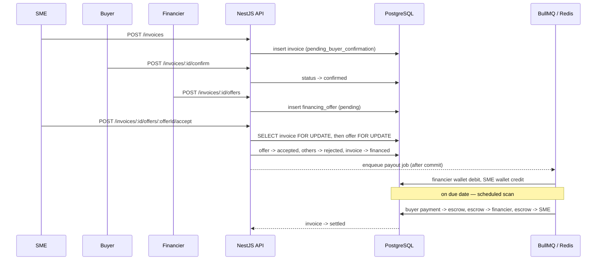
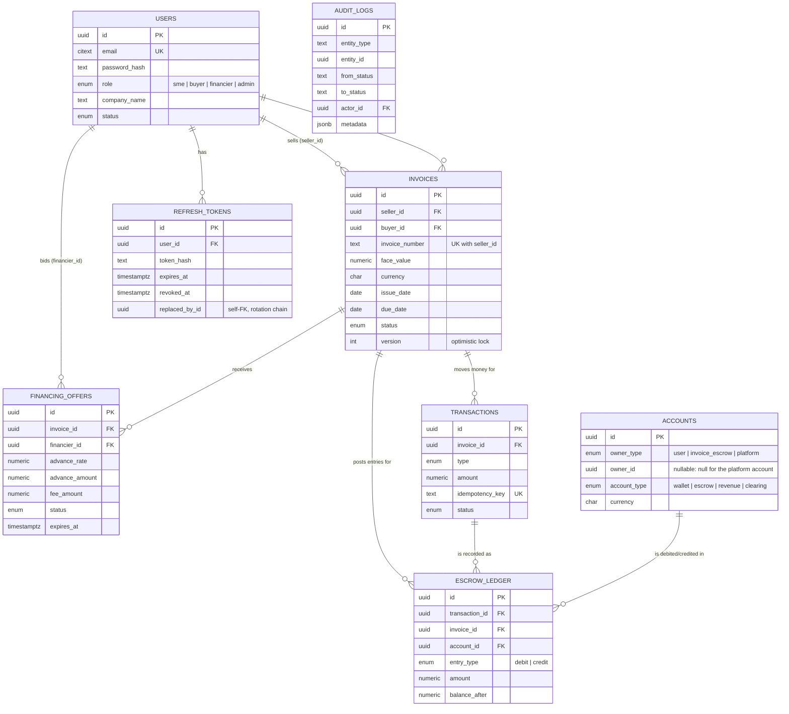

# Invoice Financing Platform

A backend for a platform where SMEs convert buyer-confirmed invoices into immediate cash via financier bidding. Buyers confirm invoices, financiers bid to advance payment at a discount, SMEs accept an offer and get paid immediately, and on the invoice's due date the platform settles the invoice through an internal escrow ledger — splitting the buyer's payment between the financier (their advance + fee) and the SME (the residual).

Built as a backend-focused portfolio project, prioritizing correctness, concurrency safety, and real-world backend engineering practice over speed of delivery.

## Tech stack

| Concern | Choice |
|---|---|
| Framework | NestJS (TypeScript) |
| Database | PostgreSQL, via TypeORM (migrations only, `synchronize` disabled everywhere) |
| Async jobs / scheduling | Redis + BullMQ |
| Auth | JWT access + refresh tokens (rotation, reuse detection), bcrypt |
| API docs | OpenAPI/Swagger (`@nestjs/swagger`) |
| Security | Helmet, per-route rate limiting (`@nestjs/throttler`) |
| Testing | Jest (unit) + Jest/Supertest against a real Postgres+Redis (e2e) |

## Table of contents

- [Architecture](#architecture)
- [Database schema](#database-schema)
- [Concurrency & correctness safeguards](#concurrency--correctness-safeguards)
- [Getting started](#getting-started)
- [Environment variables](#environment-variables)
- [API documentation](#api-documentation)
- [Testing](#testing)
- [Project structure](#project-structure)

## Architecture

### Module breakdown

```
AppModule
├── UsersModule           user lookup (UsersRepository), GET /users/me
├── AuthModule            register/login/refresh/logout, JWT strategy, guards
├── InvoicesModule        invoice CRUD + the buyer-confirmation state machine
├── FinancingOffersModule financier bidding + the offer-acceptance flow
├── LedgerModule          the ONLY module that writes accounts/transactions/escrow_ledger
├── JobsModule            BullMQ processors (payout, settlement, settlement scan)
└── AuditModule           generic append-only audit trail, shared by the above
```

Each feature module follows the same internal shape: `entities/`, `dto/`, `repositories/` (a thin class wrapping `Repository<T>` with domain-specific methods — no service calls TypeORM's `Repository` directly), a `*.service.ts` holding business logic, and a `*.controller.ts` that's a thin HTTP adapter over the service.

**Why a dedicated `LedgerModule`:** every financial write in the system funnels through `LedgerService`. `InvoicesService` and `FinancingOffersService` never touch `accounts`, `transactions`, or `escrow_ledger` directly — this is what makes the double-entry invariant (every transaction's debits equal its credits) enforceable in one place instead of scattered across the codebase.

**Why BullMQ for the payout, not a direct call:** accepting an offer commits the state change (invoice → `FINANCED`) synchronously, then *enqueues* the payout rather than moving money in the same request. In a real deployment, the payout step would call an external payment/bank API — something with latency and failure modes you don't want inside a DB transaction holding row locks. Routing it through a queue with retries and an idempotency key is the same pattern regardless of whether the "work" behind it is a fast local DB write (today) or a slow external API call (once a real payment gateway is wired in).

### Request flow (happy path)



## Database schema



Notable schema decisions (each is a deliberate tradeoff, not an oversight — see inline comments in the migrations for the full reasoning):

- **Every schema change is a hand-written, reviewed migration** (`src/database/migrations`) — `synchronize` is never enabled, anywhere.
- **Money is `NUMERIC`, never `float`**, and is kept as a `string` all the way up through the TypeScript entities — the Postgres driver returns `NUMERIC` as a string specifically to avoid float precision loss, and the app never coerces it back to `number`. All arithmetic goes through a small `Money` wrapper around `decimal.js` (`src/common/money.ts`).
- **`escrow_ledger` is append-only at the database level** — a trigger rejects `UPDATE`/`DELETE` outright, not just at the application layer. Corrections are new offsetting entries.
- **`financing_offers` has a partial unique index** on `(invoice_id) WHERE status = 'accepted'` — the database itself guarantees at most one accepted offer per invoice, independent of any application-level check.
- **`transactions.idempotency_key` is unique** — the mechanism that makes retried/redelivered BullMQ jobs and payment webhooks safe to replay.
- **No `financed_offer_id` column on `invoices`** — that would create a circular FK with `financing_offers`. The accepted offer is looked up via the partial unique index instead.

## Concurrency & correctness safeguards

The one invariant that matters most in this system: **exactly one financier offer can ever be accepted per invoice.** It's enforced three times, independently:

1. **Row lock.** `acceptOffer` opens a DB transaction and takes `SELECT ... FOR UPDATE` on the invoice row first. A second, concurrent `acceptOffer` call on the *same invoice* physically blocks until the first transaction commits or rolls back.
2. **Re-check after acquiring the lock.** Once unblocked, the second call re-reads the invoice status, sees it's already `FINANCED`, and fails with a clean `409` instead of racing the first call.
3. **Database constraint as a backstop.** The partial unique index on `financing_offers` would reject a second accepted row even if the application-level logic above had a bug.

This is proven with a real concurrency test in `test/financing-offers.e2e-spec.ts`: two `accept` requests for two different offers on the same invoice are fired at the exact same instant with `Promise.all` against a live Postgres instance, and the test asserts exactly one `200` and one `409`.

Other safeguards worth knowing about:

- **Consistent lock ordering.** Ledger postings that touch multiple accounts (settlement touches four: clearing, escrow, financier wallet, SME wallet) always lock them in the same sorted-by-id order, regardless of what order the business logic reasoned about them in — this is what prevents deadlocks between two operations contending for the same accounts.
- **Idempotency keys, not random ones.** Every money-moving operation derives its idempotency key from the business event (`payout-<offerId>`, `settlement-<invoiceId>-<leg>`), and checks for an existing row both before *and inside* the transaction. A job retried or redelivered by BullMQ (at-least-once delivery) is a safe no-op.
- **Commit-then-enqueue.** The payout job is enqueued only after `acceptOffer`'s transaction has committed, never from inside it — a worker can never observe a job for an acceptance that hasn't durably happened yet.
- **Refresh token rotation + reuse detection.** Every refresh consumes the presented token and issues a new one. Replaying an already-rotated token is treated as compromise and revokes every session for that user — also proven live in `test/auth.e2e-spec.ts`.
- **Explicit invoice state machine** (`src/invoices/invoice-state-machine.ts`) — every valid transition is enumerated; anything else (skipping a state, re-confirming, moving out of a terminal state) is rejected with a `409`.

## Getting started

This is a monorepo: `docker-compose.yml` lives at the **repo root** (one level up from this folder) since it will eventually also run the frontend; everything else (`npm` commands, `.env`) is scoped to this `backend/` directory.

### Option A — one command (Docker)

Requires Docker and Docker Compose. No local Node, Postgres, or Redis install needed. Run from the **repo root**:

```bash
cd ..                    # if you're currently inside backend/
docker compose up --build
```

This builds the app image, starts Postgres and Redis, waits for both to be healthy, runs migrations, and starts the API on `http://localhost:3000`. Swagger docs at `http://localhost:3000/api/docs`.

The compose file ships with dev-only default secrets so it works with zero configuration. To override them (recommended beyond local/demo use), create a `.env` file in the **repo root** — Compose loads it automatically:

```bash
cp .env.example .env   # note: this is backend/.env.example -> repo-root .env, for compose specifically
docker compose up --build
```

### Option B — local Node, Dockerized Postgres/Redis

Start the databases from the repo root, then run the app itself from inside `backend/`:

```bash
cd ..  && docker compose up -d postgres redis && cd backend
cp .env.example .env
npm install
npm run migration:run
npm run start:dev
```

### Option C — fully local (Postgres/Redis installed natively)

Same as Option B, but point `backend/.env` at your local Postgres/Redis instead of starting the compose services.

## Environment variables

See `.env.example` for the full list with defaults. The important ones:

| Variable | Purpose |
|---|---|
| `DB_HOST` / `DB_PORT` / `DB_USERNAME` / `DB_PASSWORD` / `DB_DATABASE` | Postgres connection |
| `REDIS_HOST` / `REDIS_PORT` | Redis connection (BullMQ) |
| `JWT_ACCESS_SECRET` / `JWT_ACCESS_EXPIRES_IN_SECONDS` | Access token signing + lifetime |
| `JWT_REFRESH_SECRET` / `JWT_REFRESH_EXPIRES_IN_SECONDS` | Refresh token signing + lifetime |
| `SETTLEMENT_SCAN_CRON` | Cron pattern for the daily due-date settlement scan |
| `THROTTLE_TTL_MS` / `THROTTLE_LIMIT` | Global rate limit (auth endpoints set a tighter per-route limit) |
| `SWAGGER_ENABLED` | Set to `false` to disable the `/api/docs` UI |

## API documentation

Interactive OpenAPI/Swagger UI is served at **`/api/docs`** once the app is running. Every endpoint is documented there with request/response shapes; protected routes are marked with the bearer-auth scheme (use `Authorize` in the UI with an access token from `/auth/login`).

## Testing

```bash
npm test                # unit tests (mocked repositories, no DB/Redis needed)
npm run test:cov        # unit tests with coverage

npm run test:e2e        # integration tests — needs a real Postgres + Redis
```

Unit tests cover business logic in isolation: the invoice state machine (exhaustively, every valid and invalid transition), JWT rotation/reuse-detection, offer validation, and the settlement/payout ledger math. The offer-acceptance race is unit-tested too, but with a mutex standing in for what a real row lock guarantees — a mock can't prove Postgres locking actually works.

e2e tests run the real `AppModule` against a real database and Redis:

```bash
(cd .. && docker compose up -d postgres redis)   # from repo root
cp .env.test.example .env.test   # separate DB (invoice_financing_test) from dev

# the test DB itself has to exist before migrations can run against it — create it once:
docker compose exec postgres psql -U postgres -c "CREATE DATABASE invoice_financing_test;"

DB_DATABASE=invoice_financing_test npm run migration:run   # run once, against the test DB
npm run test:e2e
```

`test/financing-offers.e2e-spec.ts` is the one that matters most: it fires two real concurrent HTTP `accept` requests against the live database and asserts exactly one succeeds — the actual proof that the row-locking safeguard works, not a simulation of it.

## Project structure

```
src/
  auth/            JWT strategy, guards, refresh-token rotation, DTOs
  users/           user lookup, GET /users/me
  invoices/        invoice entity, state machine, service, controller
  financing-offers/  bidding + the locked accept-offer flow
  ledger/          accounts, transactions, escrow_ledger — the only writer of all three
  jobs/            BullMQ queues, processors, the settlement cron scheduler
  audit/           generic append-only audit trail
  common/          Money (decimal-safe math), global exception filter, logging interceptor
  database/        migrations, the TypeORM DataSource used by the CLI
test/
  *.e2e-spec.ts    integration tests against a real Postgres + Redis
  utils/           test app bootstrap, DB reset, auth helpers
docker/
  entrypoint.sh    runs migrations, then starts the app
uploads/
  invoices/        SME-attached supporting documents (PDF/PNG/JPEG, gitignored, local disk only)
```

An invoice can optionally have a supporting document attached (`POST /invoices/:id/document`, `GET /invoices/:id/document`) — a PDF/image the SME uploads for the buyer/financier to cross-check against. It's stored on local disk under `uploads/invoices/`, never parsed, and never trusted as a data source; the structured fields entered at creation remain authoritative. Visibility for download follows the same rule as reading the invoice itself.
